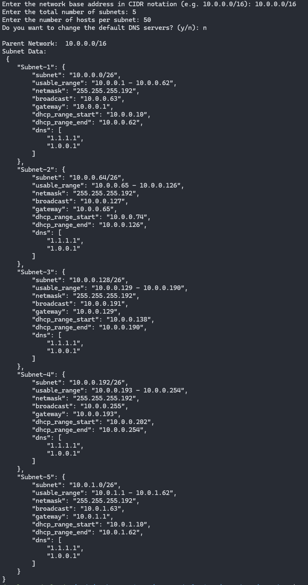

# NGS - Dynamic Subnet

A dependency-free Python module for dynamically generating subnet configuration settings with minimal input.

Automatically generate subnet configurations based on a given parent network, number of desired subnets, and number of hosts per subnet.

## Screenshot



## Table of Contents

- [Installation](#installation)
- [Usage](#usage)
  - [As Module](#as-module)
  - [As Script](#as-script)
- [Tests](#tests)
- [License](#license)

## Installation

The only method for installation at the moment is to clone the repo and install the module locally by adding the project to the `PYTHONPATH` environment variable. Or to install locally using Pip. In the future, this may be added to PyPi.

1. Clone the repo:

    ```bash
    git clone https://github.com/iiTONELOC/ngs-dynamic-subnet.git
    ```

### Via PYTHONPATH

Installs system-wide, only recommended when virtual environments are not an option. For best results, [see Local Installation Via Pip](#via-pip-as-a-local-installation)

1. Add Directory to `PYTHONPATH`, be sure to replace absolute/path/to/ngs-dynamic-subnet with the absolute path to the downloaded repo

    ```bash
   echo 'export PYTHONPATH="/absolute/path/to/ngs-dynamic-subnet/:$PYTHONPATH"' >> ~/.bashrc
   ```

2. Reload .bashrc

    ```bash
    source ~/.bashrc
    ```

### Via Pip as a Local Installation

For best results, ensure that the project using the module is configured for a virtual environment

```bash
pip install /absolute/or/relative/path/to/ngs-dynamic-subnet

# example output
  Installing build dependencies ... done
  Getting requirements to build wheel ... done
  Preparing metadata (pyproject.toml) ... done
Collecting ipaddress (from NG_Subnet==0.1.0)
  Downloading ipaddress-1.0.23-py2.py3-none-any.whl.metadata (923 bytes)
Downloading ipaddress-1.0.23-py2.py3-none-any.whl (18 kB)
Building wheels for collected packages: NG_Subnet
  Building wheel for NG_Subnet (pyproject.toml) ... done
  Created wheel for NG_Subnet: filename=NG_Subnet-0.1.0-py3-none-any.whl size=5892 sha256=7e121250c9b66fbc564806e5f48fcd221c6a6715e9c52c488f927d48ad3b1f57
  Stored in directory: /tmp/pip-ephem-wheel-cache-s3h0zlsh/wheels/8d/a2/bb/652ac2c0ce379239a4eccd041aadb09fc94789cf6969ebfe48
Successfully built NG_Subnet
Installing collected packages: ipaddress, NG_Subnet
Successfully installed NG_Subnet-0.1.0 ipaddress-1.0.23
```

## Usage

Can be used as a module or run directly as a script.

### As Module

The module exposes two functions, `calculateRequiredSubnetSize` and `generateDynamicSubnets`.

Generate Dynamic Subnets uses the Calculate Required Subnet Size in its subnet size calculation and is exported as a utility only.

The primary means of interacting with the module should be through the `generateDynamicSubnets` function directly:

  ```python
    import json
    from NG_Subnet import generateDynamicSubnets

    baseNetwork = "10.0.0.0/16"
    numSubnets = 5
    numHostsPerNet = 50

    subnetData, parentNetwork = generateDynamicSubnets(baseNetwork, numSubnets, numHostsPerNet)

    print(json.dumps(subnetData, indent=4))

    # expected output 
    """
    {
        "Subnet-1": {
            "subnet": "10.0.0.0/26",
            "usable_range": "10.0.0.1 - 10.0.0.62",
            "netmask": "255.255.255.192",
            "broadcast": "10.0.0.63",
            "gateway": "10.0.0.1",
            "dhcp_range_start": "10.0.0.10",
            "dhcp_range_end": "10.0.0.62",
            "dns": [
                "1.1.1.1",
                "1.0.0.1"
            ]
        },
        "Subnet-2": {
            "subnet": "10.0.0.64/26",
            "usable_range": "10.0.0.65 - 10.0.0.126",
            "netmask": "255.255.255.192",
            "broadcast": "10.0.0.127",
            "gateway": "10.0.0.65",
            "dhcp_range_start": "10.0.0.74",
            "dhcp_range_end": "10.0.0.126",
            "dns": [
                "1.1.1.1",
                "1.0.0.1"
            ]
        },
        "Subnet-3": {
            "subnet": "10.0.0.128/26",
            "usable_range": "10.0.0.129 - 10.0.0.190",
            "netmask": "255.255.255.192",
            "broadcast": "10.0.0.191",
            "gateway": "10.0.0.129",
            "dhcp_range_start": "10.0.0.138",
            "dhcp_range_end": "10.0.0.190",
            "dns": [
                "1.1.1.1",
                "1.0.0.1"
            ]
        },
        "Subnet-4": {
            "subnet": "10.0.0.192/26",
            "usable_range": "10.0.0.193 - 10.0.0.254",
            "netmask": "255.255.255.192",
            "broadcast": "10.0.0.255",
            "gateway": "10.0.0.193",
            "dhcp_range_start": "10.0.0.202",
            "dhcp_range_end": "10.0.0.254",
            "dns": [
                "1.1.1.1",
                "1.0.0.1"
            ]
        },
        "Subnet-5": {
            "subnet": "10.0.1.0/26",
            "usable_range": "10.0.1.1 - 10.0.1.62",
            "netmask": "255.255.255.192",
            "broadcast": "10.0.1.63",
            "gateway": "10.0.1.1",
            "dhcp_range_start": "10.0.1.10",
            "dhcp_range_end": "10.0.1.62",
            "dns": [
                "1.1.1.1",
                "1.0.0.1"
            ]
        }
    }
    """
  ```

- To overwrite the default DNS settings, provide an array of DNS servers:

  ```python
    import json
    from NG_Subnet import generateDynamicSubnets

    baseNetwork = "10.0.0.0/16"
    numSubnets = 5
    numHostsPerNet = 50

    subnetData, parentNetwork = generateDynamicSubnets(baseNetwork, numSubnets, numHostsPerNet, ['8.8.8.8'])

    print(json.dumps(subnetData, indent=4))
    # expected
    """ {
        "Subnet-1": {
            "subnet": "10.0.0.0/26",
            "usable_range": "10.0.0.1 - 10.0.0.62",
            "netmask": "255.255.255.192",
            "broadcast": "10.0.0.63",
            "gateway": "10.0.0.1",
            "dhcp_range_start": "10.0.0.10",
            "dhcp_range_end": "10.0.0.62",
            "dns": [
                "8.8.8.8"
            ]
        },
        "Subnet-2": {
            "subnet": "10.0.0.64/26",
            "usable_range": "10.0.0.65 - 10.0.0.126",
            "netmask": "255.255.255.192",
            "broadcast": "10.0.0.127",
            "gateway": "10.0.0.65",
            "dhcp_range_start": "10.0.0.74",
            "dhcp_range_end": "10.0.0.126",
            "dns": [
                "8.8.8.8"
            ]
        },
        "Subnet-3": {
            "subnet": "10.0.0.128/26",
            "usable_range": "10.0.0.129 - 10.0.0.190",
            "netmask": "255.255.255.192",
            "broadcast": "10.0.0.191",
            "gateway": "10.0.0.129",
            "dhcp_range_start": "10.0.0.138",
            "dhcp_range_end": "10.0.0.190",
            "dns": [
                "8.8.8.8"
            ]
        },
        "Subnet-4": {
            "subnet": "10.0.0.192/26",
            "usable_range": "10.0.0.193 - 10.0.0.254",
            "netmask": "255.255.255.192",
            "broadcast": "10.0.0.255",
            "gateway": "10.0.0.193",
            "dhcp_range_start": "10.0.0.202",
            "dhcp_range_end": "10.0.0.254",
            "dns": [
                "8.8.8.8"
            ]
        },
        "Subnet-5": {
            "subnet": "10.0.1.0/26",
            "usable_range": "10.0.1.1 - 10.0.1.62",
            "netmask": "255.255.255.192",
            "broadcast": "10.0.1.63",
            "gateway": "10.0.1.1",
            "dhcp_range_start": "10.0.1.10",
            "dhcp_range_end": "10.0.1.62",
            "dns": [
                "8.8.8.8"
            ]
        }
    }
    """
  ```

- If necessary, the gateway for each subnet can be set as the DNS server by using 'GATEWAY' or ['GATEWAY'] for the list of DNS servers:

  ```python
    import json
    from NG_Subnet import generateDynamicSubnets

    baseNetwork = "10.0.0.0/16"
    numSubnets = 5
    numHostsPerNet = 50

    subnetData, parentNetwork = generateDynamicSubnets(baseNetwork, numSubnets, numHostsPerNet, 'GATEWAY')

    print(json.dumps(subnetData, indent=4))
    # expected
    """
    Subnet Data:
    {
        "Subnet-1": {
            "subnet": "10.0.0.0/26",
            "usable_range": "10.0.0.1 - 10.0.0.62",
            "netmask": "255.255.255.192",
            "broadcast": "10.0.0.63",
            "gateway": "10.0.0.1",
            "dhcp_range_start": "10.0.0.10",
            "dhcp_range_end": "10.0.0.62",
            "dns": [
                "10.0.0.1"
            ]
        },
        "Subnet-2": {
            "subnet": "10.0.0.64/26",
            "usable_range": "10.0.0.65 - 10.0.0.126",
            "netmask": "255.255.255.192",
            "broadcast": "10.0.0.127",
            "gateway": "10.0.0.65",
            "dhcp_range_start": "10.0.0.74",
            "dhcp_range_end": "10.0.0.126",
            "dns": [
                "10.0.0.65"
            ]
        },
        "Subnet-3": {
            "subnet": "10.0.0.128/26",
            "usable_range": "10.0.0.129 - 10.0.0.190",
            "netmask": "255.255.255.192",
            "broadcast": "10.0.0.191",
            "gateway": "10.0.0.129",
            "dhcp_range_start": "10.0.0.138",
            "dhcp_range_end": "10.0.0.190",
            "dns": [
                "10.0.0.129"
            ]
        },
        "Subnet-4": {
            "subnet": "10.0.0.192/26",
            "usable_range": "10.0.0.193 - 10.0.0.254",
            "netmask": "255.255.255.192",
            "broadcast": "10.0.0.255",
            "gateway": "10.0.0.193",
            "dhcp_range_start": "10.0.0.202",
            "dhcp_range_end": "10.0.0.254",
            "dns": [
                "10.0.0.193"
            ]
        },
        "Subnet-5": {
            "subnet": "10.0.1.0/26",
            "usable_range": "10.0.1.1 - 10.0.1.62",
            "netmask": "255.255.255.192",
            "broadcast": "10.0.1.63",
            "gateway": "10.0.1.1",
            "dhcp_range_start": "10.0.1.10",
            "dhcp_range_end": "10.0.1.62",
            "dns": [
                "10.0.1.1"
            ]
        }
    }
    """
  ```

### As Script

Additionally, the subnet calculator can be invoked as a script and executed from the command line:

```bash
python3 /absolute/or/relative/path/to/ngs-dynamic-subnet
```

## Tests

Basic tests have been included and are runnable via `pytest` from the project root:

```bash
pytest ./tests

# expect similar output
=============================================== test session starts ================================================
platform linux -- Python 3.12.3, pytest-7.4.4, pluggy-1.4.0
rootdir: /home/developer/code/python-projects/NG_Subnet
collected 2 items

tests/test_generateDynamicSubnets.py .                                                                       [ 50%]
tests/test_requiredSize.py .                                                                                 [100%]

================================================ 2 passed in 0.01s =================================================
```

## License

[License](./LICENSE)
